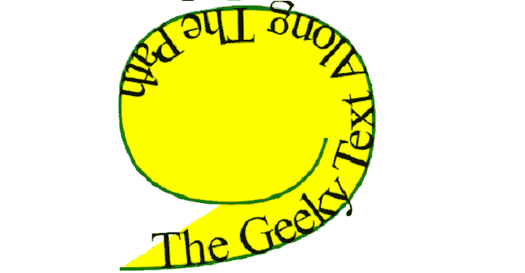
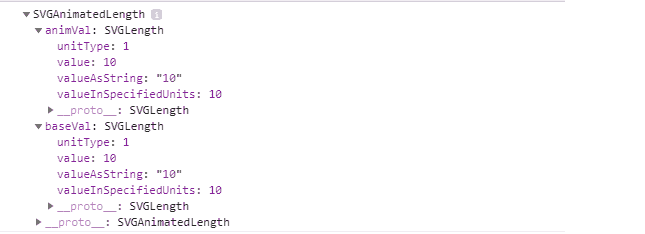
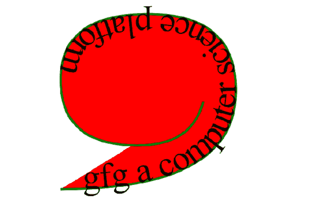
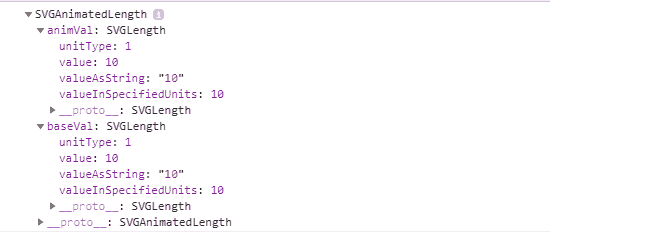

# SVG 文本元素。启动偏移属性

> 哎哎哎:# t0]https://www . geeksforgeeks . org/SVG-text item-start offset-property/

**SVG textpath element . start offset**属性返回一个与给定 textpath 元素的属性相对应的**svorganimatedlength**对象。

**语法:**

```html
TextPathElement.startOffset
```

**返回值:**该属性返回 **SVGAnimatedLength** 对象，该对象可用于获取 TextPath 元素的 *startOffset* 。

**例 1:**

## 超文本标记语言

```html
<!DOCTYPE html> 
<html>

<body>
    <svg viewBox="0 0 200 500"
        xmlns="http://www.w3.org/2000/svg"> 

        <path id="Geek" fill="yellow" stroke="green"
            d="M10, 90 Q90, 90 90, 45 Q90, 10 50, 10 Q10, 
              10 10, 40 Q10, 70 45, 70 Q70, 70 75, 50" /> 

        <text> 
            <textPath href="#Geek" id="gfg" 
                startoffset="10" > 
                The Geeky Text Along The Path 
            </textPath> 
        </text> 

        <script type="text/javascript">
            var gfg = document.getElementById('gfg');
            console.log(gfg.startOffset);
        </script>
    </svg>  
</body> 

</html>
```

**输出:**

*   
*   **控制台输出:**
    

**例 2:**

## 超文本标记语言

```html
<!DOCTYPE html> 
<html> 

<body>
    <svg viewBox="0 0 200 500"
        xmlns="http://www.w3.org/2000/svg"> 

        <path id="Geek" fill="red" stroke="green"
            d="M10, 90 Q90, 90 90, 45 Q90, 10 50, 10 Q10, 
               10 10, 40 Q10, 70 45, 70 Q70, 70 75, 50" /> 

        <text> 
            <textPath href="#Geek" id="gfg" startoffset="10" > 
                gfg a computer science platform
            </textPath> 
        </text> 
        <script type="text/javascript">
            var gfg = document.getElementById('gfg');
            console.log(gfg.startOffset);
        </script>
    </svg>  
</body>

</html>
```

**Output:**

*   
*   **控制台输出:**
    