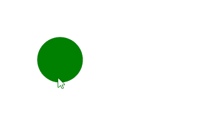

# SVG `<title>`元素

> 原文:[https://www.geeksforgeeks.org/svg-title-element/](https://www.geeksforgeeks.org/svg-title-element/)

**<标题> SVG 元素**提供了任何 SVG 容器 [](https://developer.mozilla.org/en-US/docs/Web/SVG/Element#Container_elements) 元素或图形 [](https://developer.mozilla.org/en-US/docs/Web/SVG/Element#Graphics_elements) 元素的可访问的短文本描述。

<title>元素中的文本不作为图形的一部分呈现，但浏览器通常将其显示为工具提示。当您将鼠标悬停在元素上时，将显示该元素的标题。</title>

**语法:**

```html
<title> TITLE HERE </title>
```

**属性:**

*   **核心属性:**这些属性是 id 等核心属性。
*   **样式属性:**这些属性定义样式、exp、类、样式。

**示例:**从`<g> element`继承属性制作绿色连续圆圈。

```html
<!DOCTYPE html>
<html>

<body>
    <svg viewBox="0 0 100 100">
        <circle cx="5" cy="5" r="2" fill="green">
            <title>I'm a Geeky Circle</title>
        </circle>
    </svg>
</body>

</html>
```

**输出:**



**支持的浏览器:**

*   谷歌 Chrome
*   微软公司出品的 web 浏览器
*   火狐浏览器
*   苹果 Safari
*   歌剧