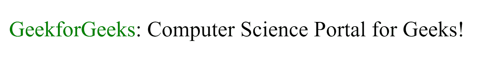
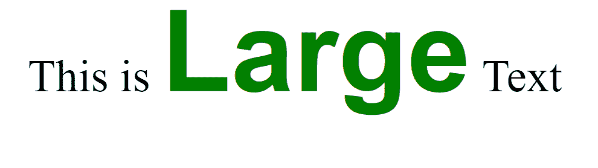

# SVG `<tspan>`元素

> 原文:[https://www.geeksforgeeks.org/svg-tspan-element/](https://www.geeksforgeeks.org/svg-tspan-element/)

SVG 代表可缩放矢量图形。它可以用来制作像在 HTML 画布中的图形和动画。

SVG`<strong>`T2>元素定义了一个<文本>元素或另一个
T6>元素中的潜台词。它允许根据用户需要调整潜台词的风格和/或位置。

**语法:**

```html
<tspan attributes="" >
    Subtext
</tspan>
```

**属性:**

*   **x:** 字形的 x 轴坐标。
*   **y:** 字形的 y 轴坐标。
*   **dx:** 沿 x 轴移动。
*   **dy:** 沿 y 轴移位。
*   **旋转:**旋转字形。
*   **文本长度:**渲染文本的长度。
*   **长度调整:**根据渲染长度进行调整。

**例 1:**

```html
<!DOCTYPE html>
<html>

<body>
    <svg viewBox="0 0 400 400" 
         xmlns="http://www.w3.org/2000/svg">
        <style>
            tspan { font: bold; fill: green; }
        </style>

        <text x="10" y="30" class="small">
            <tspan>GeekforGeeks</tspan>: 
       Computer Science Portal for Geeks!
        </text>

    </svg>
</body>

</html>
```

**输出:**



**示例 2:** 淡化矩形的颜色

```html
<!DOCTYPE html>
<html>

<body>
    <svg viewBox="0 0 400 400" 
         xmlns="http://www.w3.org/2000/svg">
        <style>
            tspan { fill: green; font: bold 40px sans-serif;}
        </style>

        <text x="10" y="30" class="small">
            This is <tspan>Large</tspan> Text
        </text>

    </svg>
</body>

</html>
```

**输出:**



**支持的浏览器:**此 SVG 元素支持以下浏览器:

*   谷歌 Chrome
*   微软公司出品的 web 浏览器
*   火狐浏览器
*   苹果 Safari
*   歌剧