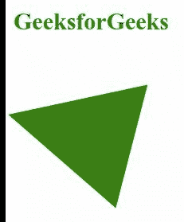

# SVG 类型属性

> 原文:[https://www.geeksforgeeks.org/svg-type-attribute/](https://www.geeksforgeeks.org/svg-type-attribute/)

**类型属性**是一个非特定属性，根据其使用的上下文有不同的含义。

*   它为值随时间变化的<*动画变换* >元素定义了变换的类型。
*   它定义了矩阵运算的类型，为< *feColorMatrix* >元素。
*   它为*<><FeFuncB><FeFuncR>*和 *< feFuncA >* 元素定义了组件传递函数的类型。
*   它为*<>*元素定义了过滤器原语是否应该执行湍流或噪声功能。
*   它定义了元素的内容类型，为 *<风格的>* 和*的<脚本的>* 元素。

**语法:**

```html
type = "value"
```

**属性值:***类型*属性可用于以下元素:

*   **<动画变换> :** 该元素包括类型属性，其值如*平移、缩放、旋转、倾斜、倾斜。*
*   **< feColorMatrix > :** 该元素包括类型属性，其值类似于*矩阵、饱和、旋转、亮度到 lpha。*
*   **<湍流> :** 该元素包括类型属性，其值类似于*分形噪声、湍流。*
*   **<FeFuncR><FeFuncG><FeFuncB>和< feFuncA > :** 这些元素包括类型属性，其值类似于*标识、表格、离散、线性、伽玛。*

以下示例说明了*类型*属性的使用。

**例 1:**

```html
<!DOCTYPE html>
<html>

<body>
    <h1 style="color: green;">
        GeeksforGeeks
    </h1>

    <svg width="320" height="320" 
        viewBox="20 30 120 120" 
        xmlns="http://www.w3.org/2000/svg">

        <polygon points="60, 30 90, 90 30, 90" fill="green">

            <animateTransform attributeName="transform" 
                attributeType="XML" type="rotate" 
                from="0 60 70" to="360 60 70"
                dur="5s" repeatCount="indefinite" />
        </polygon>
    </svg>
</body>

</html>
```

**输出:**



**例 2:**

```html
<!DOCTYPE html>
<html>

<body>
    <div style="color: green; 
             margin-left: 50px;">

        <h1>GeeksforGeeks</h1>

        <svg viewBox="0 0 480 100" 
            xmlns="http://www.w3.org/2000/svg">

            <filter id="geek2" x="-20%" y="-20%" 
                width="150%" height="150%">

                <feTurbulence type="turbulence" 
                    baseFrequency="0.05" numOctaves="5"
                    result="turbulence" />

                <feDisplacementMap in2="turbulence" 
                    in="SourceGraphic" scale="20" />
            </filter>

            <polygon points="50, 9 60.5, 39.5 92.7, 
                40.1 67, 59.5 76.4, 90.3 50, 71.9 
                23.6, 90.3 32.9, 59.5 7.2, 40.1 39.4, 
                39.5" style="filter: url(#geek2);"
                fill="hsl(106, 80%, 50%)" />
        </svg>
    </div>
</body>

</html>
```

**输出:**

