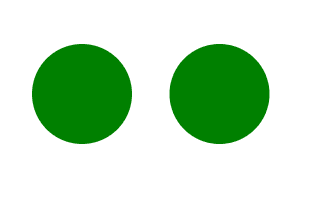
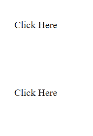

# SVG `<use>`元素

> 原文:[https://www.geeksforgeeks.org/svg-use-element/](https://www.geeksforgeeks.org/svg-use-element/)

SVG 代表可缩放矢量图形。它可以用来制作像在 HTML 画布中的图形和动画。

SVG `<strong>` < use >元素从 SVG 文档中获取节点，并将它们复制到其他地方。

**语法:**

```html
<use href="" >
    Subtext
</use>

```

**属性:**

*   **x:** x 轴坐标图像的定位。
*   **y:** y 轴坐标图像的定位。
*   **宽度:**图像的宽度。
*   **高度:**图像的高度。
*   **href:** 图像的来源。
*   **全局属性:**使用了一些全局属性，如核心属性、造型属性等。

**例 1:**

```html
<!DOCTYPE html>
<html>

<body>
    <svg width="400" height="200"
        xmlns="http://www.w3.org/2000/svg">       
        <circle id="gfg" 
                cx="100" 
                cy="100" 
                r="40" 
                fill="green"/>

        <use href="#gfg" x="110"></use>
    </svg>
</body>

</html>
```

**输出:**



**例 2:**

```html
<!DOCTYPE html>
<html>

<body>
    <svg width="400" height="200"
        xmlns="http://www.w3.org/2000/svg">  
        <a href="https://ide.geeksforgeeks.org"
           id="gfg">      
            <text x="50"
                  y="90" 
                  text-anchor="middle">
                Click Here
            </text>
        </a>
        <use href="#gfg"
             y="110"></use>
    </svg>
</body>

</html>
```

**输出:**



**支持的浏览器:**

*   铬
*   边缘
*   火狐浏览器
*   旅行队
*   微软公司出品的 web 浏览器
*   歌剧