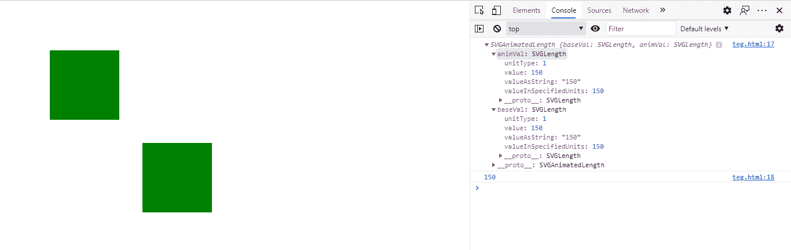
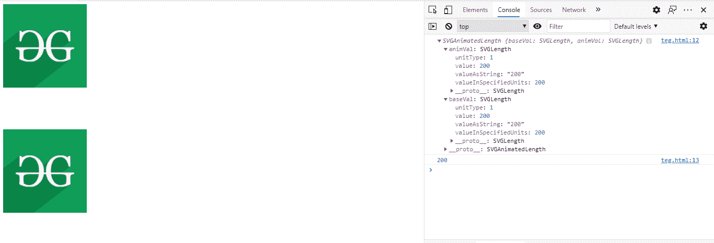

# SVG UseElement.height 属性

> 原文:[https://www . geesforgeks . org/SVG-useelement-height-property/](https://www.geeksforgeeks.org/svg-useelement-height-property/)

**SVG UseElement.height 属性** 返回一个对应于给定 use element 属性的 SVGAnimatedLength 对象

**语法:**

```html
UseElement.height

```

**返回值:**该属性返回 SVGAnimatedLength 对象，该对象可用于获取所用元素的高度。

**例 1:**

## 超文本标记语言

```html
<!DOCTYPE html> 
<html> 

<body>
  <svg width="800" height="800"
        xmlns="http://www.w3.org/2000/svg">        
        <rect id="gfg" 
                x="100" 
                y="100" 
                height="150"
                width="150"
                fill="green"/> 

        <use href="#gfg" x="200" y="200" height="150"
             width="150" id="useid"></use> 
        <script type="text/javascript">
          var u = document.getElementById("useid");
          console.log(u.height);
          console.log(u.height.animVal.value)
        </script>
    </svg> 
</body>
</html>
```

**输出:**



**例 2:**

## 超文本标记语言

```html
<!DOCTYPE html> 
<html> 

<body>
  <svg width="800" height="800"
        xmlns="http://www.w3.org/2000/svg">        
        <image href=
               "https://media.geeksforgeeks.org/wp-content/
               cdn-uploads/20190710102234/download3.png" 
               height="200" width="200" id="gfg"/>

        <use href="#gfg" x=0 y=300 height="200" 
             width="200" id="useid"></use> 
        <script type="text/javascript">
          var u = document.getElementById("useid");
          console.log(u.height);
          console.log(u.height.baseVal.value);
        </script>
    </svg> 
</body>
</html>
```

**输出:**

