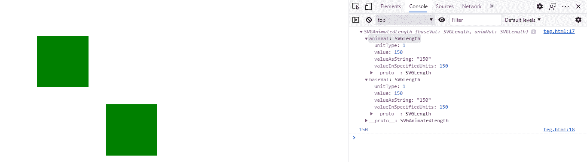
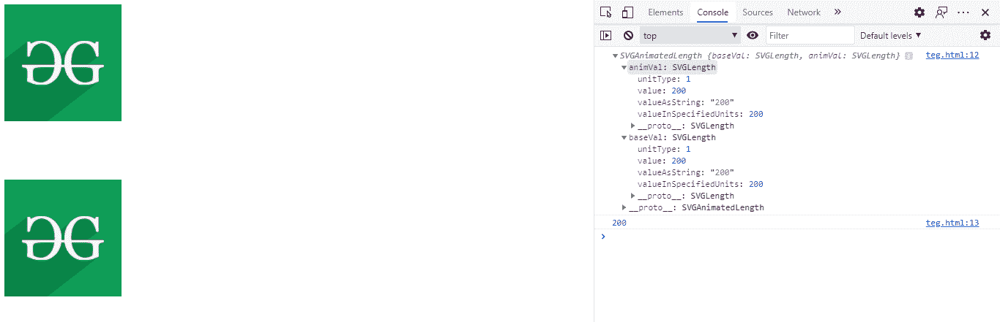

# SVG useelement . width property

> 原文:[https://www . geesforgeks . org/SVG-useelement-width-property/](https://www.geeksforgeeks.org/svg-useelement-width-property/)

**SVG UseElement.width 属性** 返回一个对应于给定 use 元素属性的 SVGAnimatedLength 对象。

**语法:**

```html
UseElement.width

```

**返回值:**这个属性返回 SVGAnimatedLength 对象，可以用来获取 use 元素的宽度。

**例 1:**

## 超文本标记语言

```html
<!DOCTYPE html> 
<html> 

<body>
  <svg width="800" height="800"
        xmlns="http://www.w3.org/2000/svg">        
        <rect id="gfg" 
                x="100" 
                y="100" 
                height="150"
                width="150"
                fill="green"/> 

        <use href="#gfg" x="200" y="200" 
            height="150" width="150" id="useid">
        </use> 

        <script type="text/javascript">
          var u = document.getElementById("useid");
          console.log(u.width);
          console.log(u.width.animVal.value)
        </script>
    </svg> 
</body>

</html>
```

**输出:**



**例 2:**

## 超文本标记语言

```html
<!DOCTYPE html> 
<html> 

<body>
  <svg width="800" height="800"
        xmlns="http://www.w3.org/2000/svg">        
        <image href=
"https://media.geeksforgeeks.org/wp-content/cdn-uploads/20190710102234/download3.png" 
            height="200" width="200" id="gfg"/>

        <use href="#gfg" x=0 y=300 height="200" 
             width="200" id="useid"></use> 
        <script type="text/javascript">
          var u = document.getElementById("useid");
          console.log(u.width);
          console.log(u.width.baseVal.value);
        </script>
    </svg> 
</body>

</html>
```

**输出:**

