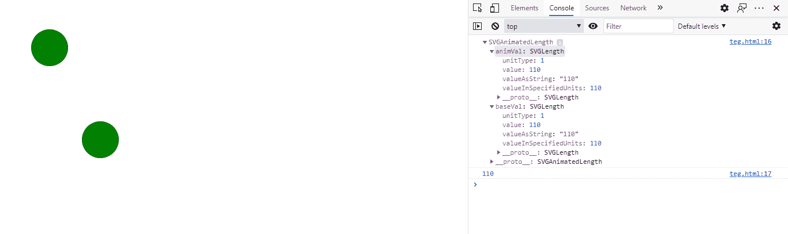
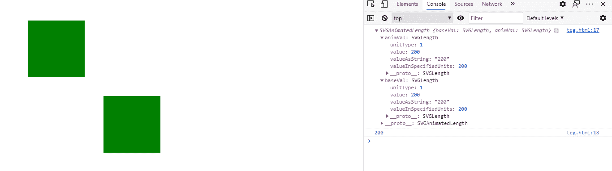

# SVG UseElement.x 属性

> 原文:[https://www.geeksforgeeks.org/svg-useelement-x-property/](https://www.geeksforgeeks.org/svg-useelement-x-property/)

**SVG UseElement.x 属性** 返回一个对应于给定 use 元素属性的 SVGAnimatedLength 对象

**语法:**

```html
UseElement.x
```

**返回值:**这个属性返回 SVGAnimatedLength 对象，可以用来获取 use 元素的 x。

**例 1:**

## 超文本标记语言

```html
<!DOCTYPE html> 
<html> 

<body>
    <svg width="400" height="400"
        xmlns="http://www.w3.org/2000/svg">        
        <circle id="gfg" 
                cx="100" 
                cy="100" 
                r="40" 
                fill="green"/> 

        <use href="#gfg" x="110" y="200" id="useid"></use> 
        <script type="text/javascript">
          var u = document.getElementById("useid");
          console.log(u.x);
          console.log(u.x.animVal.value)
        </script>
    </svg> 
</body>
</html>
```

**输出:**



**例 2:**

## 超文本标记语言

```html
<!DOCTYPE html> 
<html> 

<body>
  <svg width="800" height="800"
        xmlns="http://www.w3.org/2000/svg">        
        <rect id="gfg" 
                x="100" 
                y="100" 
                height="150"
                width="150"
                fill="green"/> 

        <use href="#gfg" x="200" y="200" id="useid"></use> 
        <script type="text/javascript">
          var u = document.getElementById("useid");
          console.log(u.x);
          console.log(u.x.animVal.value)
        </script>
    </svg> 
</body>
</html>
```

**输出:**

