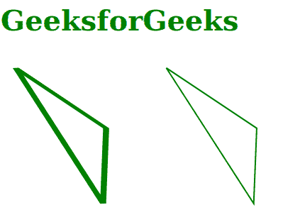
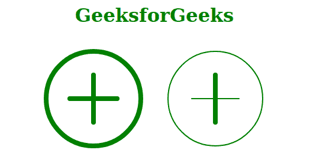

# SVG 矢量效果属性

> 原文:[https://www.geeksforgeeks.org/svg-vector-effect-attribute/](https://www.geeksforgeeks.org/svg-vector-effect-attribute/)

**矢量效果**属性定义了绘制对象时要使用的矢量效果。这些效果在滤镜、蒙版和剪辑的合成操作之前应用。只对 *<圆>、<椭圆>、< foreignObject >、<像>、<线>、<路径>、<多边形>、<折线>、<矩形>、<文字>、<文字路径><tspan【tspan】*

**注意:**这个效果也可以作为 CSS 属性使用。

**语法:**

```html
vector-effect = none | non-scaling-size | non-scaling-stroke 
                          | fixed-position | non-rotation 

```

**属性值:**该属性接受上面提到的和下面描述的值:

*   **无:**规定不施加矢量效应。这是属性的默认值。
*   **非缩放描边:**修改对象的描边方式。笔画宽度不再依赖于元素和缩放级别的变换。
*   **非缩放-大小:**指定元素及其后代使用的用户坐标系的比例不变。
*   **非旋转:**指定抑制元素及其后代使用的用户坐标系的旋转和倾斜。
*   **固定位置:**指定元素及其后代使用的用户坐标系位置固定。

**示例 1:** 下面的示例说明了使用*非缩放笔画*属性值来使用单词间距属性。

## 超文本标记语言

```html
<!DOCTYPE html>
<html>

<body>
    <h1 style="color: green;
            font-size: 40px;">
        GeeksforGeeks
    </h1>

    <svg viewBox="120 5 1200 940">
        <path vector-effect="non-scaling-size"
            transform="translate(100,0)scale(4,1)" 
            d="M10,20L40,100L39,200z"
            stroke="green" stroke-width="2px" 
            fill="none">
        </path>

        <path vector-effect="non-scaling-stroke" 
            transform="translate(300,0)scale(4,1)" 
            d="M10,20L40,100L39,200z"
            stroke="green" stroke-width="2px" 
            fill="none">
        </path>
    </svg>
</body>

</html>
```

**输出:**



**示例 2:** 以下示例使用*非缩放尺寸*属性值说明了*字间距*属性的使用。

## 超文本标记语言

```html
<!DOCTYPE html>
<html>

<body>
    <h1 style="color: green; 
            text-align: center;">
        GeeksforGeeks
    </h1>

    <div class="geeks" style="text-align: center;">

        <!-- Here we have not applied
         vector-effect attribute  -->
        <svg width="200" height="200" 
            viewBox="0 0 50 50">

            <circle cx="25" cy="25" r="20" fill="none" 
                stroke="green" stroke-width="2" />

            <path d="M25 15 L 25 35" fill="none" 
                    stroke="green" stroke-width="2" 
                    stroke-linecap="round" />

            <path d="M15 25 L 35 25" fill="none" 
                stroke="green" stroke-width="2" 
                stroke-linecap="round" />
        </svg>

        <!-- Here we have applied
         vector-effect attribute  -->
        <svg width="200" height="200" 
            viewBox="0 0 50 50">

            <circle cx="25" cy="25" r="20" fill="none" 
                stroke="green" stroke-width="2"
                vector-effect="non-scaling-stroke" />

            <path d="M25 15 L 25 35" fill="none" 
                stroke="green" stroke-width="2" 
                stroke-linecap="round"
                vector-effect="non-scaling-size" />

            <path d="M15 25 L 35 25" fill="none" 
                stroke="green" stroke-width="2" 
                stroke-linecap="round"
                vector-effect="non-scaling-stroke" />
        </svg>
    </div>
</body>

</html>
```

**输出:**

