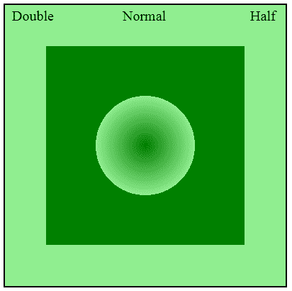
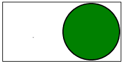
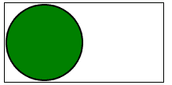
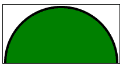

# SVG `<view>`元素

> 原文:[https://www.geeksforgeeks.org/svg-view-element/](https://www.geeksforgeeks.org/svg-view-element/)

SVG 代表可缩放矢量图形。它可以用来制作像在 HTML 画布中的图形和动画。 **<视图>** 元素用于更改原始 SVG 元素的视图框属性。它通过引用元素的 id 作为 URL 的目标片段来使用。它提供了放大或缩小渲染内容等功能。

**语法:**

```html
<view viewBox="" preserveAspectRatio="" viewTarget=""/>
```

**属性:**

*   **视图框:**定义适合绘图区域的坐标。
*   **保留纵横比:**它指示具有提供给定纵横比的视图框的元素必须如何适应具有不同纵横比的视口。
*   **视图目标:**它由作为视图主要焦点的元素的 id 值列表组成。

**例 1:**

```html
<!DOCTYPE html>
<html>

<body>
    <svg width="400" height="400" 
        viewBox="0 0 100 100">

        <defs>
            <radialGradient id="gradient">
                <stop offset="0%" stop-color="green" />
                <stop offset="50%" stop-color="lightgreen" />
                <stop offset="50%" stop-color="green" />
            </radialGradient>
        </defs>

        <rect x="0" y="0" width="100%" 
            height="100%" fill="url(#gradient)" 
            style=" stroke: black;
                    fill: lightgreen;" />

        <rect x="15" y="15" width="70%" 
            height="70%" fill="url(#gradient)" />

        <view id="Normal" viewBox="0 0 100 100" />
        <view id="HalfV" viewBox="0 0 200 200" />
        <view id="Double" viewBox="0 0  50  50" />

        <a xlink:href="#Double">
            <text x="3" y="6" font-size="5">
                Double
            </text>
        </a>

        <a xlink:href="#Normal">
            <text x="42" y="6" font-size="5">
                Normal
            </text>
        </a>

        <a xlink:href="#Half">
            <text x="87" y="6" font-size="5">
                Half
            </text>
        </a>
    </svg>
</body>

</html>
```

**输出:**



**示例 2:** **Meet** 关键字用于拟合视图端口内的图像。

```html
<!DOCTYPE html>
<html>

<body>

    <svg width="200" height="100" 
        viewBox="0 0 50 50" 
        preserveAspectRatio="xMaxYMin meet"
        style="border: 1px solid black; fill:black;">

        <circle cx="25" cy="25" r="24" 
            style="stroke: #000000; fill:green;" />
    </svg>
</body>

</html>
```

**输出:**



**例 3:**

```html
<!DOCTYPE html>
<html>

<body>
    <svg width="200" height="100" 
        viewBox="0 0 50 50" 
        preserveAspectRatio="xMinYMin meet"
        style="border: 1px solid black; 
                fill:black;">

        <circle cx="25" cy="25" r="24" 
            style="stroke: #000000; 
                    fill:green;" />
    </svg>
</body>

</html>
```

**输出:**



**示例 4:切片**关键字将图像中不适合视口的任何部分切片。

```html
<!DOCTYPE html>
<html>

<body>
    <svg width="200" height="100" 
        viewBox="0 0 50 50" 
        preserveAspectRatio="xMinYMin slice"
        style="border: 1px solid black; 
                fill:black;">

        <circle cx="25" cy="25" r="24" 
            style="stroke: #000000; 
                    fill:green;" />
    </svg>
</body>

</html>
```

**输出:**

