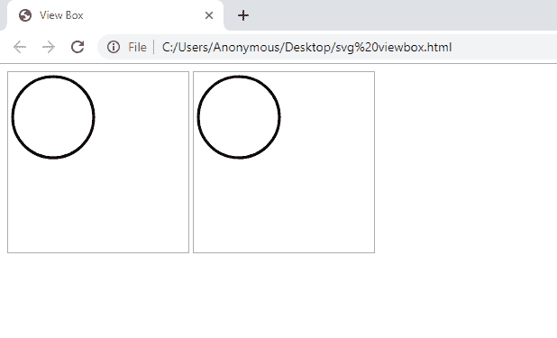
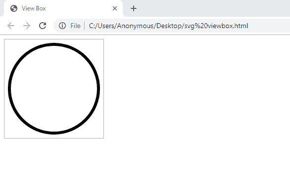
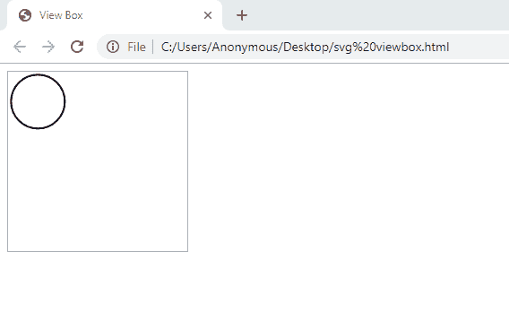
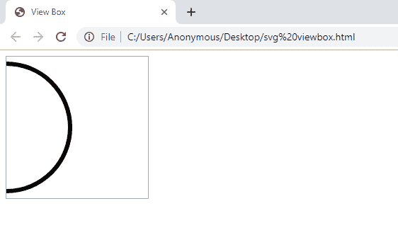
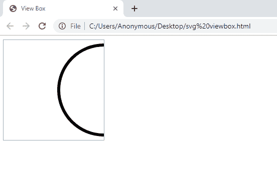
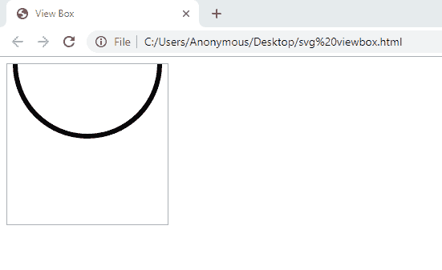
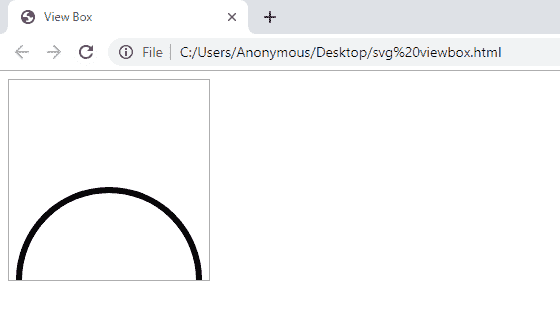

# SVG 查看框属性

> 原文:[https://www.geeksforgeeks.org/svg-viewbox-attribute/](https://www.geeksforgeeks.org/svg-viewbox-attribute/)

视图框是 HTML 中 SVG 元素的一个属性。它用于缩放 SVG 元素，这意味着我们可以设置坐标以及宽度和高度。

**语法:**

```html
viewBox = "min-x min-y width height"
```

**属性值:**

*   **min-x:** 用于设置横轴。它用于使 SVG 在水平轴上移动(即左右移动)。
*   **min-y:** 用于设置纵轴。它用于使 SVG 在垂直轴上移动(即上下移动)。
*   **宽度:**用于设置视域框的宽度。
*   **高度:**用于设置视域框的高度。

**注:**字母‘B’在 viewBox 中为大写。

因此，在这些值的帮助下，我们可以缩放 SVG 向量，并根据 SVG 元素的宽度和高度属性中定义的值来更改其方向(即向左、向右、向上或向下)。

**示例:**

```html
<!DOCTYPE html>
<html>

<head>
    <title>SVG viewBox Attribute</title>

    <style type="text/css">
        svg {
            border: 1px solid #aaa;
        }
    </style>
</head>

<body>

    <!-- Without viewBox -->
    <svg width="200" height="200">
        <circle cx="50" cy="50" r="45"
            stroke="#000" stroke-width="3"
            fill="none"/>
    </svg>

    <!-- With viewBox -->
    <svg width="200" height="200" viewBox="0 0 200 200">
        <circle cx="50" cy="50" r="45" stroke="#000"
            stroke-width="3" fill="none"/>
    </svg>
</body>

</html>
```

**输出:**


这里，方形框显示了 SVG 的边框，通过 viewBox 属性，我们可以设置矢量的比例和平移。上述两个 SVG 元素的输出是相同的。我们将 SVG 和 viewBox 的宽度和高度设置为相等(即 200)，这样我们就可以得到两个大小相同的圆。

**宽度和高度值:**使用宽度和高度值，您可以更改 SVG 向量的大小。因此，如果我们想改变大小并使其变大，那么在视图框中设置宽度和高度的值，使其小于 SVG 元素的宽度和高度属性。

**示例:**

```html
<!DOCTYPE html>
<html>

<head>
    <title>SVG viewBox Attribute</title>

    <style type="text/css">
        svg {
            border: 1px solid #aaa;
        }
    </style>
</head>

<body>

    <svg width="200" height="200" viewBox="0 0 100 100">

    <circle cx="50" cy="50" r="45" stroke="#000"
            stroke-width="3" fill="none"/>
    </svg>
</body>

</html>
```

**输出:**


所以现在，要改变 SVG 向量的大小并使其变小，我们必须在 viewBox 中设置宽度和高度的值，大于 SVG 元素的宽度和高度属性。

**示例:**

```html
<!DOCTYPE html>
<html>

<head>
    <title>SVG viewBox Attribute</title>

    <style type="text/css">
        svg {
            border: 1px solid #aaa;
        }
    </style>
</head>

<body>
    <svg width="200" height="200" viewBox="0 0 300 300">

    <circle cx="50" cy="50" r="45" stroke="#000"
            stroke-width="3" fill="none"/>
    </svg>
</body>

</html>
```

**输出:**


**左移:**用正数设置 x-min 的值。它将在左侧移动 SVG。

**示例:**

```html
<!DOCTYPE html>
<html>

<head>
    <title>SVG viewBox Attribute</title>

    <style type="text/css">
        svg {
            border: 1px solid #aaa;
        }
    </style>
</head>

<body>
    <svg width="200" height="200" viewBox="50 0 100 100">

    <circle cx="50" cy="50" r="45" stroke="#000"
            stroke-width="3" fill="none"/>
    </svg>
</body>

</html>
```

**输出:**


**右移:**用负数设置 x-min 的值。它会将 SVG 移动到右侧。

**示例:**

```html
<!DOCTYPE html>
<html>

<head>
    <title>SVG viewBox Attribute</title>

    <style type="text/css">
        svg {
            border: 1px solid #aaa;
        }
    </style>
</head>

<body>
    <svg width="200" height="200" viewBox="-50 0 100 100">

    <circle cx="50" cy="50" r="45" stroke="#000"
            stroke-width="3" fill="none"/>
    </svg>
</body>

</html>
```

**输出:**


**顶部移动:**将 y-min 的值设置为正数。它将移动顶部的 SVG。

**示例:**

```html
<!DOCTYPE html>
<html>

<head>
    <title>SVG viewBox Attribute</title>

    <style type="text/css">
        svg {
            border: 1px solid #aaa;
        }
    </style>
</head>

<body>
    <svg width="200" height="200" viewBox="0 50 100 100">

    <circle cx="50" cy="50" r="45" stroke="#000"
            stroke-width="3" fill="none"/>
    </svg>
</body>

</html>
```

**输出:**


**底部移动:**用负数设置 x-min 的值。它会移动底部的 SVG。

**示例:**

```html
<!DOCTYPE html>
<html>

<head>
    <title>SVG viewBox Attribute</title>

    <style type="text/css">
        svg {
            border: 1px solid #aaa;
        }
    </style>
</head>

<body>
    <svg width="200" height="200" viewBox="0 -50 100 100">

    <circle cx="50" cy="50" r="45" stroke="#000"
            stroke-width="3" fill="none"/>
    </svg>
</body>

</html>
```

**输出:**
