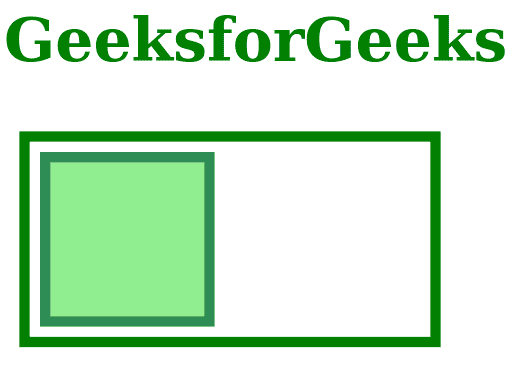

# SVG 可见性属性

> 原文:[https://www.geeksforgeeks.org/svg-visibility-attribute/](https://www.geeksforgeeks.org/svg-visibility-attribute/)

*可见性*属性允许您控制图形元素的可见性。仅对以下元素有影响*<a><altGlyph><音频><画布><圆><椭圆><foreignObject><iframe><图像><直线><路径><多边形<*

**语法:**

```html
visibility = visible | hidden | collapse

```

**属性值:**可见性属性接受上面提到的和下面描述的值

*   **可见:**该值表示元素将可见。
*   **隐藏:**该值表示元素将不可见。
*   **塌陷:**这个值相当于隐藏。

**示例 1:** 以下是说明使用*可见性*属性的示例。

## 超文本标记语言

**输出:**



**示例 2:** 下面是说明可见性属性使用的示例。

## 超文本标记语言

```html
<!DOCTYPE html>
<html>

<body>
    <h1 style="color:green; font-size:60px;">
        GeeksforGeeks
    </h1>

    <svg viewBox="0 0 620 520" 
        xmlns="http://www.w3.org/2000/svg">

        <rect x="10" y="10" width="200" 
            height="100" stroke="green" 
            stroke-width="5" fill="transparent" />

        <g stroke="seagreen" stroke-width="5" 
            fill="lightgreen">

            <rect x="20" y="20" width="80" 
                height="80" visibility="hidden" />

            <rect x="120" y="20" width="80" 
                height="80" visibility="visible" />
        </g>
    </svg>

</body>

</html>
```

**输出:**

