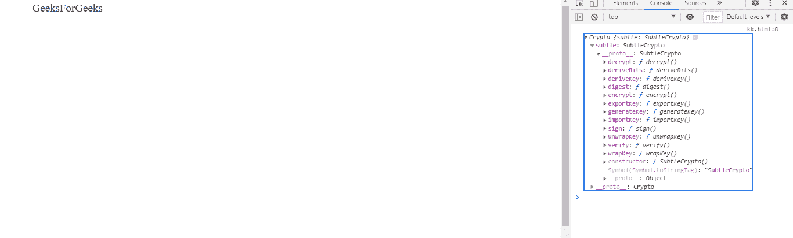
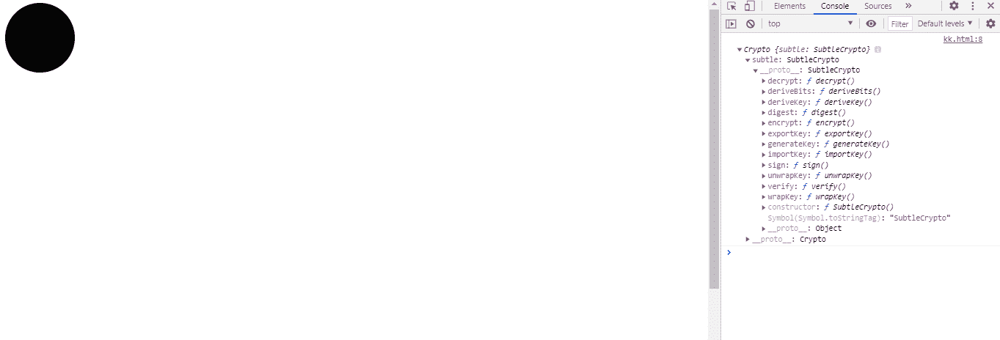

# SVG 窗口.加密属性

> 原文:[https://www.geeksforgeeks.org/svg-window-crypto-property/](https://www.geeksforgeeks.org/svg-window-crypto-property/)

**SVG Window.crypto 属性**返回与全局对象相关联的 crypto 对象。

**语法:**

```html
var cryptoObj = window.crypto
```

**返回值:**该属性返回与全局对象关联的加密对象。

**例 1:**

```html
<!DOCTYPE html>
<html>

<body>
    <svg viewBox="0 0 1000 1000" 
        xmlns="http://www.w3.org/2000/svg">

        <text x="50" y="20" font-size="20px" 
            onmouseover="check()">
            GeeksForGeeks
        </text>

        <script type="text/javascript">
            function check() {
                console.log(window.crypto);
            }
        </script>
    </svg>
</body>

</html>
```

**输出:**



**例 2:**

```html
<!DOCTYPE html>
<html>

<body>
    <svg viewBox="0 0 1000 1000" 
        xmlns="http://www.w3.org/2000/svg">

        <circle cx="50" cy="50" r="50" 
            onclick="check()" />

        <script type="text/javascript">
            function check() {
                console.log(window.crypto);
            }
        </script>
    </svg>
</body>

</html>
```

**输出:**

