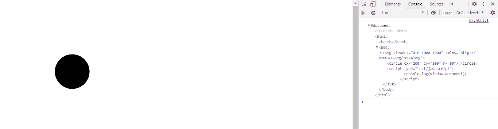
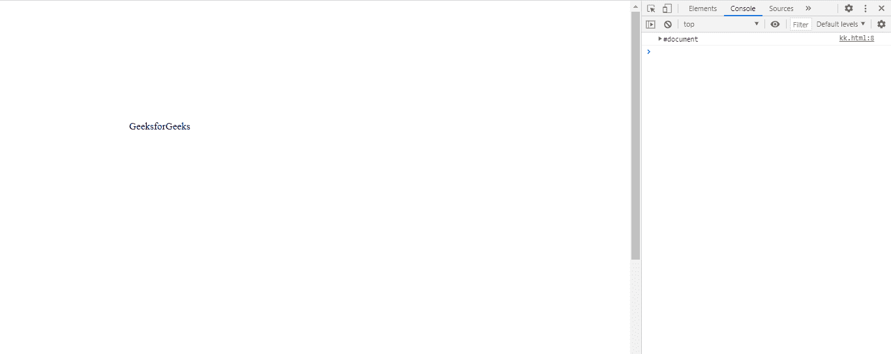

# SVG 窗口.文档属性

> 原文:[https://www.geeksforgeeks.org/svg-window-document-property/](https://www.geeksforgeeks.org/svg-window-document-property/)

**SVG Window.document 属性** 返回对窗口中包含的文档的引用。

**语法:**

```html
var object = window.document

```

**返回值:**该属性返回对窗口中包含的文档的引用。

**例 1:**

## 超文本标记语言

```html
<!DOCTYPE html>
<html>

<body>
    <svg viewBox="0 0 1000 1000" 
        xmlns="http://www.w3.org/2000/svg">

        <circle cx="200" cy="200" r="50"></circle>

        <script type="text/javascript">
            console.log(window.document);
        </script>
    </svg>
</body>

</html>
```

**输出:**



**例 2:**

## 超文本标记语言

```html
<!DOCTYPE html>
<html>

<body>
    <svg viewBox="0 0 1000 1000" 
        xmlns="http://www.w3.org/2000/svg">

        <text x="200" y="200">
            GeeksforGeeks
        </text>

        <script type="text/javascript">
            console.log(window.document);
        </script>
    </svg>
</body>

</html>
```

**输出:**

