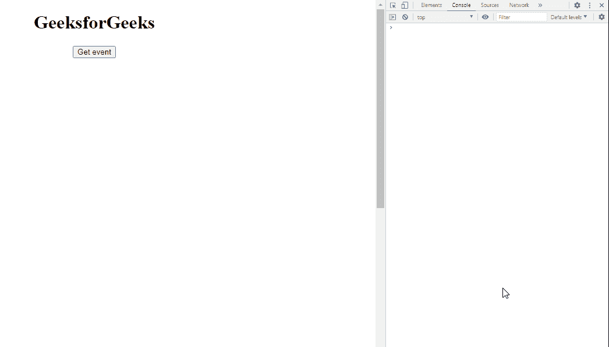

# SVG 窗口.事件属性

> 原文:[https://www.geeksforgeeks.org/svg-window-event-property/](https://www.geeksforgeeks.org/svg-window-event-property/)

**SVG Window.event 属性** 返回当前由站点代码处理的事件。

**语法:**

```html
var e = window.event
```

**返回值:**该属性返回当前由站点代码处理的事件。

**示例 1:** 在本例中，我们将使用 onclick 事件。

## 超文本标记语言

```html
<!DOCTYPE html>
<html>

<body>
    <center>
        <h1>GeeksforGeeks</h1>

        <button onclick="get()">
            Get event
        </button>

        <br><br>
        <div id="g"></div>

        <svg viewBox="0 0 1000 1000" 
            xmlns="http://www.w3.org/2000/svg">

            <script type="text/javascript">
                function get() {
                    console.log(window.event);
                }
            </script>
        </svg>
    </center>
</body>

</html>
```

**输出:**



**示例 2:** 在本例中，我们将使用 onmouseover 事件。

## 超文本标记语言

```html
<!DOCTYPE html>
<html>

<body>
    <center>
        <h1>GeeksforGeeks</h1>

        <button onmouseover="get()">
            Get event
        </button>

        <br><br>
        <div id="g"></div>

        <svg viewBox="0 0 1000 1000" 
            xmlns="http://www.w3.org/2000/svg">

            <script type="text/javascript">
                function get() {
                    console.log(window.event);
                }
            </script>
        </svg>
    </center>
</body>

</html>
```

**输出:**

