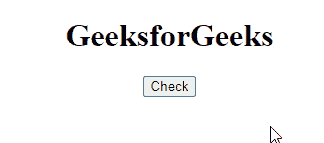
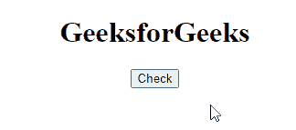

# SVG Window.isSecureContext 属性

> 原文:[https://www . geeksforgeeks . org/SVG-window-issecurecontext-property/](https://www.geeksforgeeks.org/svg-window-issecurecontext-property/)

**SVG 窗口属性** 指示上下文是否能够使用需要安全上下文的功能。

**语法:**

```html
var *isSecure* = window.isSecureContext

```

**返回值:**该属性返回布尔值

**示例 1:** 在本例中，我们将使用 onclick 事件。

## 超文本标记语言

```html
<!DOCTYPE html>
<html>

<body>
    <center>
        <h1>GeeksforGeeks</h1>

        <button onclick="get()">
            Check
        </button>

        <br><br>
        <div id="g"></div>

        <svg viewBox="0 0 1000 1000" 
            xmlns="http://www.w3.org/2000/svg">

            <script type="text/javascript">
                function get() {
                    var g = document.getElementById("g");

                    g.innerHTML = " Is it secure? : " 
                            + window.isSecureContext;
                }
            </script>
        </svg>
    </center>
</body>

</html>
```

**输出:**



**示例 2:** 在本例中，我们将使用 onmouseover 事件。

## 超文本标记语言

```html
<!DOCTYPE html>
<html>

<body>
    <center>
        <h1>GeeksforGeeks</h1>

        <button onmouseover="get()">
            Check
        </button>

        <br><br>
        <div id="g"></div>

        <svg viewBox="0 0 1000 1000" 
            xmlns="http://www.w3.org/2000/svg">

            <script type="text/javascript">
                function get() {
                    var g = document.getElementById("g");

                    g.innerHTML = " Is it secure? : "
                        + window.isSecureContext;
                }
            </script>
        </svg>
    </center>
</body>

</html>
```

**输出:**



**支持的浏览器:**

*   谷歌 Chrome
*   边缘
*   火狐浏览器
*   旅行队
*   歌剧