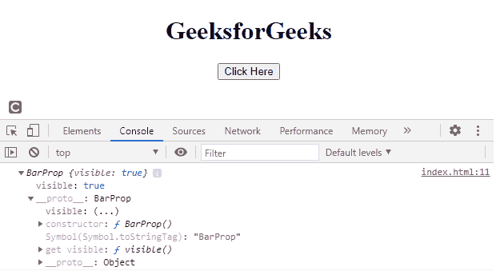

# SVG 窗口.菜单栏属性

> 原文:[https://www.geeksforgeeks.org/svg-window-menubar-property/](https://www.geeksforgeeks.org/svg-window-menubar-property/)

SVG `<em>` window.menubar 属性返回menu bar 对象，通过它我们可以检查可见性。

**语法:**

```html
var mb = window.menubar

```

**返回值:**该属性返回菜单栏对象。

**示例 1:**

## HTML

```html
<!DOCTYPE html>
<html>

<body>
    <center>
        <h1>GeeksforGeeks</h1>

        <button onclick="get()">
            Click Here
        </button>

        <svg viewBox="0 0 10000 10000" 
            xmlns="http://www.w3.org/2000/svg">

            <script type="text/javascript">
                function get() {
                    var g = document.getElementById("g");
                    console.log(window.menubar);
                }
            </script>
        </svg>
    </center>
</body>

</html>
```

**输出:**



**示例 2:**

## HTML

```html
<!DOCTYPE html>
<html>

<body>
    <center>
        <h1>GeeksforGeeks</h1>

        <button onclick="get()">
            Click Here 
        </button>

        <div id="g"></div>

        <svg viewBox="0 0 1000 1000" 
            xmlns="http://www.w3.org/2000/svg">

            <script type="text/javascript">
                function get() {
                    var g = document.getElementById("g");
                    g.innerHTML = "Is it visible? : "
                        + window.menubar.visible;
                }
            </script>
        </svg>
    </center>
</body>

</html>
```

**输出:**


**支持的浏览器:**

*   谷歌 Chrome
*   边缘
*   火狐浏览器
*   旅行队
*   歌剧
*   微软公司出品的 web 浏览器