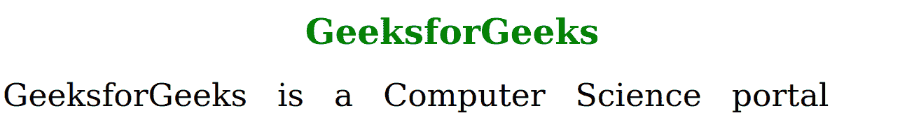
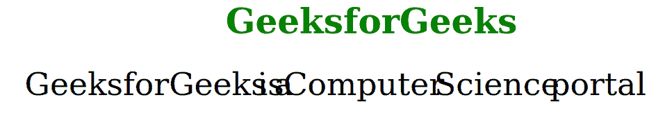

# SVG 字间距属性

> 原文:[https://www.geeksforgeeks.org/svg-word-spacing-attribute/](https://www.geeksforgeeks.org/svg-word-spacing-attribute/)

SVG 中的**字间距**属性用来表示字与字之间的间距。可以通过使用属性的长度值来更改此间距。

当长度在没有单位标识符的情况下被提及时，浏览器将其作为当前用户坐标系中的宽度值进行处理，否则，如果它与单位标识符之一一起被提及，则浏览器将其转换为当前用户坐标系中的相应值。

**注意:**该属性可以应用于任何元素，但只对 *<替代字形><文字><文字路径><tref>和<tspan>T3*元素有效。**

**语法:**

```html
word-spacing ="length"
```

**属性值:**该属性接受如上所述的单个值，如下所述:

*   **长度:**是一个数字，指定单词之间的间距。后面可以跟一个长度单位，如 *px、cm、mm、pt、*等。

以下示例说明了**单词间距**属性的使用:

**例 1:**

## 超文本标记语言

```html
<!DOCTYPE html>
<html>

<body>
    <h1 style="color:green; font-size:50px; 
               text-align:center;">
        GeeksforGeeks
    </h1>

    <svg viewBox="0 0 450 150" 
        xmlns="http://www.w3.org/2000/svg">

        <text y="15" word-spacing="10">
            GeeksforGeeks is a Computer 
            Science portal
        </text>
    </svg>
</body>

</html>
```

**输出:**



**例 2:**

## 超文本标记语言

```html
<!DOCTYPE html>
<html>

<body>
    <h1 style="color:green; font-size:50px; 
               text-align:center;">
        GeeksforGeeks
    </h1>

    <svg viewBox="0 0 450 150" 
        xmlns="http://www.w3.org/2000/svg">

        <text x="0" y="40" word-spacing="-10">
            GeeksforGeeks is a Computer 
            Science portal
        </text>
    </svg>
</body>

</html>
```

**输出:**

