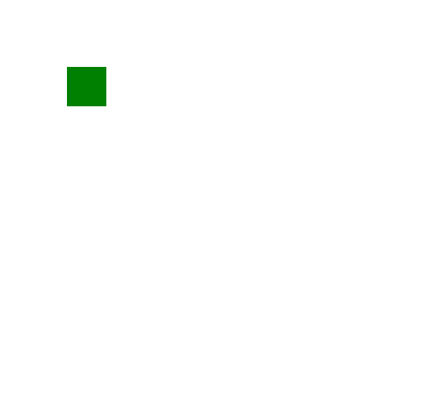

# SVG×属性

> 原文:[https://www.geeksforgeeks.org/svg-x-attribute/](https://www.geeksforgeeks.org/svg-x-attribute/)

**x** 属性定义了用户坐标系中的 x 轴坐标。

**语法:**

```html
x = "x-coordinate"
```

**属性值:**

*   **长度:**我们要设置 x 轴的长度。
*   **百分比:**我们要设置 x 轴的百分比。

我们将使用 x 属性为元素设置 x 坐标。

**示例 1:**x 轴不同的矩形元素。

```html
<!DOCTYPE html>
<html>

<body>
    <svg width="200" height="200" 
            viewBox="0 0 300 300">

        <rect x="20" y="20" width="60" 
            height="60" fill="green" />

        <rect x="120" y="20" width="60" 
            height="60" fill="green" />

        <rect x="220" y="20" width="60" 
            height="60" fill="green" />
    </svg>
</body>

</html>
```

**输出:**


**例 2:**x 轴相同的矩形元素。

```html
<!DOCTYPE html>
<html>

<body>
    <svg width="200" height="200" 
            viewBox="0 0 300 300">

        <rect x="20" y="20" width="60" 
            height="60" fill="green" />

        <rect x="20" y="120" width="60" 
            height="60" fill="green" />

        <rect x="20" y="120" width="60" 
            height="60" fill="green" />
    </svg>
</body>

</html>
```

**输出:**


**例 3:** 使用百分比值。

```html
<!DOCTYPE html>
<html>

<body>
    <svg width="200" height="200" 
            viewBox="0 0 300 300">

        <rect x="30%" y="30%" width="60" 
            height="60" fill="green" />
    </svg>
</body>

</html>
```

**输出:**

