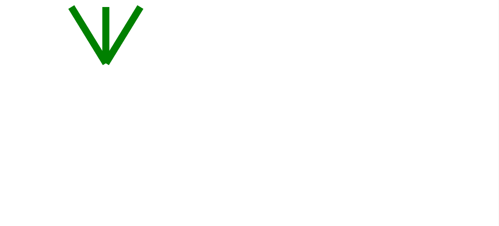

# SVG x1 属性

> 原文:[https://www.geeksforgeeks.org/svg-x1-attribute/](https://www.geeksforgeeks.org/svg-x1-attribute/)

**x1 属性**用于指定绘制需要多个坐标的 SVG 元素的第一个 x 坐标。

使用此属性的元素:

*   [<线>](https://www.geeksforgeeks.org/html-svg-line/)
*   <线性梯度>

**语法:**

```html
x1 = "x1-coordinate"
```

**属性值:**

*   **长度:**我们要设置 x1 坐标的长度。
*   **百分比:**我们要设置 x1 坐标的百分比。

我们将使用 x1 属性来设置 x1 坐标。

**例 1:** 在本例中，我们将使用长度值。

```html
<!DOCTYPE html>
<html>

<body>
    <svg viewBox="0 0 70 70" 
        xmlns="http://www.w3.org/2000/svg">

        <line x1="2" x2="7" y1="1" 
            y2="9" stroke="green" />

        <line x1="6" x2="7" y1="1" 
            y2="9" stroke="green" />

        <line x1="10" x2="7" y1="1" 
            y2="9" stroke="green" />
    </svg>
</body>

</html>
```

**输出:**


**例 2:** 在本例中，我们将使用百分比值。

```html
<!DOCTYPE html>
<html>

<body>
    <svg viewBox="0 0 70 70" 
        xmlns="http://www.w3.org/2000/svg">

        <line x1="14%" x2="21%" y1="1" 
                y2="9" stroke="green" />

        <line x1="21%" x2="21%" y1="1" 
                y2="9" stroke="green" />

        <line x1="28%" x2="21%" y1="1" 
                y2="9" stroke="green" />
    </svg>
</body>

</html>
```

**输出:**

