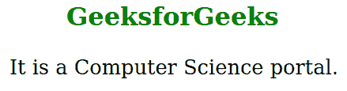

# SVG xml:lang 属性

> 原文:[https://www.geeksforgeeks.org/svg-xmllang-attribute/](https://www.geeksforgeeks.org/svg-xmllang-attribute/)

SVG 中的 *xml:lang* 属性用于表示网站上包含文本内容的内容和属性中使用的主要语言。它在所有的 XML 方言中都是允许的，因为它是一个通用属性。所有元素都使用这个属性。

**语法:**

```html
xml:lang = "language-tag"
```

**属性值:**该属性接受如上所述的值，如下所述:

*   **语言标签:**该值表示给定元素使用的语言。语言是根据 BCP 47 规范定义的。

**例 1:**

## 超文本标记语言

```html
<!DOCTYPE html>
<html>

<body>
    <h1 style="color: green; 
            margin-left: 80px;">
        GeeksforGeeks
    </h1>

    <svg viewBox="-5 -20 800 100" 
        xmlns="http://www.w3.org/2000/svg">

        <text xml:lang="en-US">
            It is a Computer
            Science portal.
        </text>
    </svg>
</body>

</html>
```

**输出:**



**例 2:**

## 超文本标记语言

```html
<!DOCTYPE html>
<html>

<body>
    <h1 style="color: green; 
            margin-left: 100px;
            font-size: 30px;">
        GeeksforGeeks
    </h1>

    <svg viewBox="20 -10 200 100" 
        xmlns="http://www.w3.org/2000/svg">
        <text xml:lang="ar">
            مرحبا
        </text>
    </svg>
</body>

</html>
```

**输出:**

