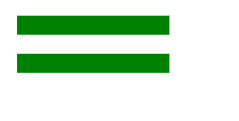
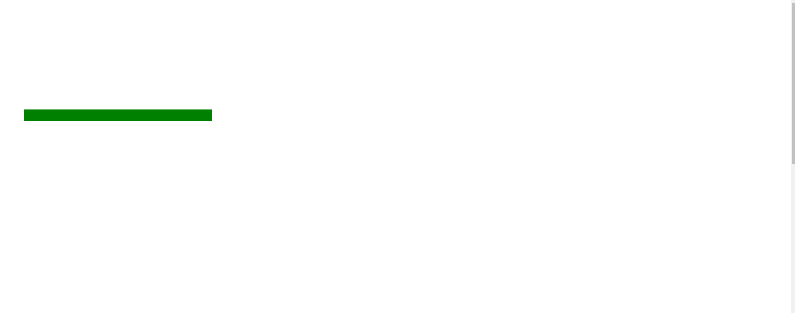

# SVG y1 属性

> 原文:[https://www.geeksforgeeks.org/svg-y1-attribute/](https://www.geeksforgeeks.org/svg-y1-attribute/)

**y1** 属性用于指定绘制需要多个坐标的 SVG 元素的第一个 y 坐标。

使用此属性的元素:

*   [<线>](https://www.geeksforgeeks.org/html-svg-line/)
*   <lineargradient></lineargradient>

**语法:**

```html
y1 = "y1-coordinate"
```

**属性值:**

*   **长度:**:我们要设置 y1 坐标的长度。
*   **百分比:**我们要设置 y1 坐标的百分比。

我们将使用 y1 属性来设置 y1 坐标。

**示例 1:** 在本例中，我们将使用长度值。

```html
<!DOCTYPE html>
<html>

<body>
    <svg viewBox="0 0 70 70" 
        xmlns="http://www.w3.org/2000/svg">

        <line x1="1" x2="9" y1="5" 
            y2="5" stroke="green" />

        <line x1="1" x2="9" y1="7" 
            y2="7" stroke="green" />
    </svg>
</body>

</html>
```

**输出:**



**示例 2:** 在本例中，我们将使用百分比值。

```html
<!DOCTYPE html>
<html>

<body>
    <svg viewBox="0 0 70 70" 
        xmlns="http://www.w3.org/2000/svg">

        <line x1="3%" x2="27%" y1="15%" 
            y2="15%" stroke="green" />
    </svg>
</body>

</html>
```

**输出:**

