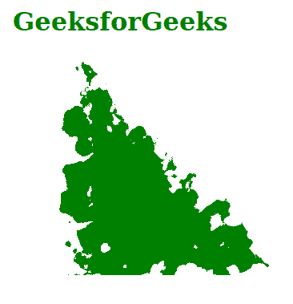
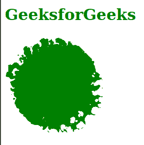

# SVG yChannelSelector 属性

> 原文:[https://www . geesforgeks . org/SVG-ychannelselector-attribute/](https://www.geeksforgeeks.org/svg-ychannelselector-attribute/)

SVG 中的 **yChannelSelector** 属性用于指示来自 *in2* 的通道，该通道用于沿 y 轴移动中*的像素。该属性仅由<*fe 置换映射* >元素使用。*

**语法:**

```html
yChannelSelector = "R | G | B | A"

```

**属性值:**该属性接受四个值，如上所述，如下所述:

*   **R:** 指定在 *in2* 中定义的给定图像的红色通道将用于沿 y 轴移动图像的像素。
*   **G:** 指定在 *in2* 中定义的给定图像的绿色通道将用于沿 y 轴移动图像的像素。
*   **B:** 它指定在 *in2* 中定义的给定图像的蓝色通道将用于沿 y 轴移动图像的像素。
*   **A:** 它指定在 *in2* 中定义的给定图像的 alpha 通道将用于沿 y 轴移动图像的像素。

**示例 1:** 本示例使用“G”属性值说明了 *yChannelSelector* 属性的使用。

## 超文本标记语言

```html
<!DOCTYPE html>  
<html> 
    <body>
        <h1 style="color: green;
                margin-left: 20px;">
              GeeksforGeeks
        </h1>
        <svg width="500" 
             height="500" 
             viewBox="-30 50 200 100"
             xmlns="http://www.w3.org/2000/svg">

        <filter id="geek">
            <feTurbulence 
             type="turbulence" 
             baseFrequency="0.06"
             numOctaves="3" 
             result="turbulence"/>
        <feDisplacementMap   
             in2="turbulence" 
             in="SourceGraphic"
             scale="40" 
             xChannelSelector="R" 
             yChannelSelector="G"/>
        </filter>

        <polygon points="0 0, 100 100, 0 100" 
             fill ="green" 
             style="filter: url(#geek)"/>
        </svg>
    </body>
</html>
```

**输出:**



**示例 2:** 本示例使用“R”属性值说明了 *yChannelSelector* 属性的使用。

## 超文本标记语言

```html
<!DOCTYPE html>  
<html>  

    <body>
        <h1 style="color: green;">
              GeeksforGeeks
        </h1>
        <svg width="200" height="200" 
            viewBox="0 0 220 220"
            xmlns="http://www.w3.org/2000/svg">

        <filter id="geek">
            <feTurbulence 
            type="turbulence" 
            baseFrequency="0.05"
            numOctaves="2" 
            result="turbulence"/>
        <feDisplacementMap in2="turbulence" 
            in="SourceGraphic"
            scale="50" 
            xChannelSelector="R" 
            yChannelSelector="R"/>
        </filter>

        <circle cx="100" cy="100" 
            r="100" fill ="green"
            style="filter: url(#geek)"/>
        </svg>
    </body>

</html>
```

**输出:**

