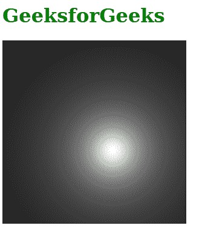
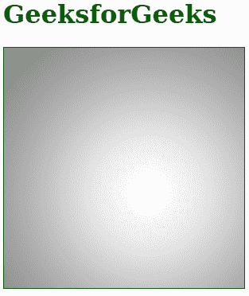

# SVG z 属性

> 原文:[https://www.geeksforgeeks.org/svg-z-attribute/](https://www.geeksforgeeks.org/svg-z-attribute/)

SVG 中的***【z】*****属性用于定义由< *滤镜* >元素上的 *primitiveUnits* 属性建立的光源在坐标系中沿 z 轴的位置。**

**我们假设正 z 轴朝向观看内容的人，并且沿着 z 轴的一个单位等于 x 和 y 中的一个单位。使用 z 属性的两个 SVG 元素是< *fePointLight* >和<*fespolight*>。**

****语法:****

```html
z = "number" 
```

****属性值:**该属性接受一个值，如上所述，如下所述:**

*   ****数字:**表示数字，可以是整数，也可以是带小数的数字。**

**下面的例子说明了 **z** 属性的使用。**

****例 1:****

## **超文本标记语言**

```html
<!DOCTYPE html>
<html>

<body>
    <h1 style="color: green;">
        GeeksforGeeks
    </h1>

    <svg viewBox="0 0 420 200" 
    xmlns="http://www.w3.org/2000/svg">

        <filter id="geek1" x="0" y="0" 
            width="50%" height="50%">

            <feDiffuseLighting in="SourceGraphic">
                <fePointLight x="60" y="60" z="10" />
            </feDiffuseLighting>
        </filter>

        <rect x="0" y="0" width="200" 
            height="200" 
            style="filter: url(#geek1);" />
    </svg>
</body>

</html>
```

****输出:****

****

****例 2:****

## **超文本标记语言**

```html
<!DOCTYPE html>
<html>

<body>
    <h1 style="color: green;">
        GeeksforGeeks
    </h1>
    <svg viewBox="0 0 420 200" 
        xmlns="http://www.w3.org/2000/svg">

        <filter id="geek2" x="0" y="0" 
            width="50%" height="50%">

            <feDiffuseLighting in="SourceGraphic">
                <fePointLight x="60" y="60" z="50" />
            </feDiffuseLighting>
        </filter>

        <rect x="0" y="0" width="200" 
            height="200" 
            style="filter: url(#geek2);" />
    </svg>
</body>

</html>
```

****输出:****

****